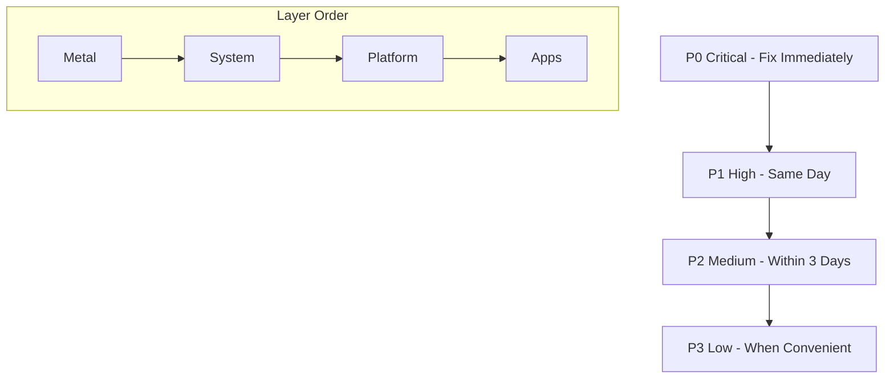

## User Input

```text
$ARGUMENTS
```

You **MUST** consider the user input before proceeding (if not empty).

The text the user typed after the command **is** their priority input - it may specify:
- Specific layers to focus on (Metal, System, Platform, Apps)
- Specific services or namespaces to investigate
- Whether to skip certain phases
- Any special instructions or constraints

---

# Homelab Reconnaissance & Maintenance Workflow

## Overview
This workflow performs a comprehensive analysis of the entire Homelab infrastructure, combining reconnaissance across all layers with maintenance verification, security auditing, and update planning. It produces a single unified report covering health status, available updates, security findings, and actionable recommendations.

> [!IMPORTANT]
> **Sync Requirement**: This workflow exists in multiple locations that must stay synchronized:
> - `~/Documents/GitHub/homelab/.agent/workflows/homelab-recon.md` (Primary/Source)
> - `~/.gemini/antigravity/global_workflows/homelab-recon.md` (Antigravity)
> - `~/.config/opencode/command/homelab-recon.md` (OpenCode Global)
> - `.opencode/command/homelab-recon.md` (Workspace)
>
> When updating this file, **always copy changes to all locations**.

> [!CAUTION]
> **FOUNDATIONAL RULES APPLY** - See `_foundational-rules.md`
>
> This workflow follows the **Homelab Foundational Rules**. These rules are NON-NEGOTIABLE:
> - **Rule 1**: Work is NOT complete until ALL layers are GREEN (or issues are tracked for action)
> - **Rule 2**: Zero tolerance - all findings must be documented and tracked
> - **Rule 3**: NO pause, NO stop, NO quit until recon is complete
> - **Rule 4**: Continuous validation during analysis
> - **Rule 5**: Report must be comprehensive with all layers analyzed
>
> **Recon is complete when ALL layers are analyzed, ALL findings documented, and issue tracking is updated.**

> [!IMPORTANT]
> **Do NOT add comments to issues.** Comments are reserved for humans only.
> Always **edit the original issue body** to merge new data into the existing content.

## References
- **Documentation**: https://homelab.eaglepass.io
- **Primary Repo**: https://git.eaglepass.io/ops/homelab
- **Fallback Repo**: https://github.com/brimdor/homelab (auto-synced from primary)

---

## Phase 1: Prerequisites & Access

### 1.1 Ensure Local Tools Are Up-to-Date
Before starting, verify all local tools are current and functional.

### 1.2 Access Priority
- **Primary**: Use the local system for all work
- **Controller Fallback**: Only use when local access to Kubernetes cluster is unavailable
  - SSH: `ssh brimdor@10.0.50.120`
  - Homelab files: `~/homelab`

### 1.3 Clone/Update Homelab Repository
```bash
# Clone if not present, or pull latest changes
git clone https://git.eaglepass.io/ops/homelab ~/homelab 2>/dev/null || (cd ~/homelab && git pull)
```

### 1.4 SSH Access to Nodes
Direct SSH to nodes from workstation is **intentionally blocked**. To access nodes:

1. SSH to Controller: `ssh brimdor@10.0.50.120`
2. Navigate to homelab: `cd homelab`
3. Start tools container: `make tools`
4. Wait ~20 seconds for container to be ready
5. SSH to node from container: `ssh root@<nodeIP>`

**Controller**: 10.0.50.120 (user: brimdor, passwordless SSH)
**Nodes**: SSH as root from Controller only

---

## Phase 2: Layered Reconnaissance

### 2.1 Metal Layer (Hardware & OS)

**Validation Steps**:
- Check Controller reachability (ssh brimdor@10.0.50.120)
- Check node reachability via Controller
- Check Resource Usage (CPU, RAM, Disk) via `kubectl top nodes`
- Check System Temperatures (if accessible)
- Check ZFS/RAID health if applicable

| Status | Criteria |
|--------|----------|
| **GREEN** | Controller reachable. All nodes online. CPU < 50%, RAM < 80%, Disk < 80%. Temps normal. No hardware errors. |
| **YELLOW** | High resource usage (CPU > 80% or RAM > 90%). Disk > 90%. Temps elevated but safe. Minor hardware warnings. |
| **RED** | Controller unreachable. Node offline. Disk full (> 98%). Critical hardware failures. Overheating. |

### 2.2 System Layer (Kubernetes Core)

**Validation Steps**:
- `kubectl get nodes` (All Ready)
- `kubectl get pods -n kube-system` (All Running/Completed)
- Check CNI (Cilium) status
- Check CSI (Rook-Ceph) status and health

| Status | Criteria |
|--------|----------|
| **GREEN** | All nodes Ready. Core pods healthy. Ceph health HEALTH_OK. Network policies active. |
| **YELLOW** | Single node NotReady (if HA). Non-critical system pods restarting. Ceph HEALTH_WARN (non-critical). |
| **RED** | Multiple nodes down. API Server unreachable. Ceph HEALTH_ERR. CNI failures blocking traffic. |

### 2.3 Platform Layer (Middleware)

**Validation Steps**:
- Check GitOps (ArgoCD) sync status
- Check Ingress (NGINX) functionality
- Check Certificate Management (Cert-Manager)
- Check Identity Provider (Dex/Kanidm)
- Check Monitoring (Prometheus/Grafana)

| Status | Criteria |
|--------|----------|
| **GREEN** | ArgoCD Synced & Healthy. Ingress serving traffic. Certs valid. Auth working. Monitoring active. |
| **YELLOW** | ArgoCD OutOfSync (but functional). Expiring certs (< 15 days). Minor monitoring gaps. |
| **RED** | ArgoCD broken. Ingress 404/503 loops. Expired certs. Auth down. |

### 2.4 Apps Layer (User Services)

**Validation Steps**:
- Check App Pods status
- Check Service endpoints (HTTP 200)
- Check Application logs for errors

| Status | Criteria |
|--------|----------|
| **GREEN** | All apps Running. Endpoints responsive. No critical log errors. |
| **YELLOW** | Non-critical apps down. Slow response times. Minor functional bugs. |
| **RED** | Critical apps (Emby, Gitea, etc.) down. Data corruption signs. Unusable services. |

---

## Phase 3: Service Verification & Maintenance Analysis

### 3.1 Core Infrastructure Services
- DNS (internal and external)
- Certificate management
- Ingress controllers
- Storage provisioners

### 3.2 ArgoCD Applications
- Check sync status of all applications
- Identify any degraded or out-of-sync apps
- Review recent deployment history

### 3.3 Security Audit
- Check for expired certificates
- Review secret rotation status
- Validate network policies
- Check for security advisories on running images

### 3.4 Backup Verification
- Verify backup jobs are running
- Check backup storage status
- Validate recent backup integrity

### 3.5 Update Discovery
For each component, check:
- Container image updates
- Helm chart updates
- Operator/CRD updates
- Base system updates

### 3.6 Gitea Issues & PRs Analysis

Analyze the state of open Issues and Pull Requests in the primary repository that require action. **Exclude issues labeled `maintenance`** as those are the centralized tracking issues.

#### 3.6.1 Fetch Actionable Issues
Query for open issues that are NOT labeled `maintenance`:

```bash
source ~/.config/gitea/.env

# Get all open issues
ALL_ISSUES=$(curl -s "https://git.eaglepass.io/api/v1/repos/ops/homelab/issues?state=open" \
  -H "Authorization: token $GITEA_TOKEN")

# Filter out maintenance-labeled issues (maintenance label ID = 10)
echo "$ALL_ISSUES" | jq '[.[] | select(.labels | map(.id) | contains([10]) | not)]'
```

Or use MCP tools:
- Use `gitea_list_repo_issues` with `state: open`
- Filter results to exclude items where labels contain `maintenance`

#### 3.6.2 Fetch Open Pull Requests
Query for open PRs that may need action:

```bash
source ~/.config/gitea/.env

curl -s "https://git.eaglepass.io/api/v1/repos/ops/homelab/pulls?state=open" \
  -H "Authorization: token $GITEA_TOKEN" | jq '.[] | {number, title, user: .user.login, created: .created_at, mergeable}'
```

Or use MCP tools:
- Use `gitea_list_repo_pull_requests` with `state: open`

**Identify PR Source**:
- **Renovate PRs**: Author is `renovate[bot]`, `gitea_admin`, or title starts with `chore(deps):`
- **User PRs**: All other PRs (manual changes, feature PRs, fixes)

#### 3.6.3 Categorize Findings

For each issue/PR found, categorize by:

| Category | Description | Examples |
|----------|-------------|----------|
| **Dependency Updates** | Renovate/automated PRs | `chore(deps):` PRs |
| **Bug Reports** | Issues reporting problems | Errors, failures, unexpected behavior |
| **Feature Requests** | Enhancement requests | New functionality, improvements |
| **Security** | Security-related issues | CVEs, vulnerabilities, access issues |
| **Documentation** | Docs updates needed | Missing docs, outdated info |

#### 3.6.4 Action Item Extraction

For each non-maintenance issue/PR, extract:
1. **Issue/PR Number and Title**
2. **Age** (days since created)
3. **Priority** based on labels and content
4. **Action Required** (review, merge, close, investigate)
5. **Blockers** if any (merge conflicts, failing checks, needs review)

#### 3.6.5 Include in Report

Add a new section to the report template for Gitea state:

```markdown
## Gitea Repository State

### Open Pull Requests - Renovate (Automated)
| PR | Title | Age | Status | Action Needed |
|----|-------|-----|--------|---------------|
| #X | chore(deps): [Component] | Xd | mergeable | Merge via /homelab-action |

### Open Pull Requests - User (Manual)
| PR | Title | Author | Age | Status | Action Needed |
|----|-------|--------|-----|--------|---------------|
| #X | [Title] | [user] | Xd | [mergeable/conflict] | [Review/Merge/Close] |

### Open Issues (Non-Maintenance)
| Issue | Title | Labels | Age | Priority | Action Needed |
|-------|-------|--------|-----|----------|---------------|
| #X | [Title] | [labels] | Xd | [H/M/L] | [Investigate/Fix/Close] |

### Summary
- **Renovate PRs**: X (process via /homelab-action)
- **User PRs**: X (require manual review)
- **Open Issues**: X
- **Oldest unresolved item**: #X (X days)
```

#### 3.6.6 Integration with Maintenance Issue

All actionable items discovered should be **added to the maintenance issue** during Phase 5. This centralizes all work items in a single tracking location.

> [!IMPORTANT]
> **Cross-Issue Action Items**: Open issues (non-maintenance) that require action MUST be included as action items in the maintenance issue. The maintenance issue serves as the **single source of truth** for all pending work.

**Aggregate ALL Action Items**:
1. **From Pull Requests**: Both Renovate (automated) and User (manual) PRs
2. **From Open Issues**: Any non-maintenance issue requiring action
3. **From Recon Findings**: Issues discovered during health checks

**Separate Renovate PRs from User PRs** for clarity.

#### 3.6.7 Unified Priority Matrix

All action items in the maintenance issue MUST follow this priority system:

| Priority | Criteria | Examples | Processing Order |
|:--------:|----------|----------|:----------------:|
| **P0 (Critical)** | Breaks functionality, security risk, data loss | RED status items, CVEs, failing services | IMMEDIATE |
| **P1 (High)** | Degraded performance, YELLOW warnings | High resource usage, expiring certs | Same day |
| **P2 (Medium)** | Pending updates, non-critical features | Major version updates, feature requests | Within 3 days |
| **P3 (Low)** | Minor improvements, non-major deps | Patch updates, documentation | When convenient |

**Priority Assignment Rules**:
- Issues with `status:red` label → **P0**
- Issues with `status:yellow` label → **P1**
- Issues from bug reports or security → **P1-P2**
- Renovate major updates → **P2**
- Renovate non-major updates → **P3**
- Feature requests → **P2-P3**

#### 3.6.8 Health Validation After Each Change

> [!CAUTION]
> **Mandatory Health Check**: After processing EACH action item, validate that Overall Status remains GREEN. If status degrades to YELLOW or RED, STOP and troubleshoot before proceeding.

**Validation Protocol**:
1. Complete one action item (merge PR, apply fix, etc.)
2. Wait for ArgoCD sync (if applicable)
3. Run abbreviated health check:
   - `kubectl get nodes` - All Ready
   - `kubectl get pods -A | grep -v Running | grep -v Completed` - No unexpected states
   - ArgoCD sync status - All Synced/Healthy
4. If GREEN → Proceed to next item
5. If YELLOW/RED → Troubleshoot via `/homelab-troubleshoot` until GREEN

Format for adding to maintenance issue:
```markdown
## Execution Sequence

> [!CAUTION]
> **Execute in order. Validate GREEN after EACH step before proceeding.**

| Step | Priority | Item | Type | Layer | Est. Downtime | Rollback |
|:----:|:--------:|------|------|:-----:|:-------------:|----------|
| 1 | P0 | #X | Fix | Metal | 0 min | [Plan] |
| 2 | P1 | #Y | Update | System | 0 min | [Plan] |
| 3 | P2 | #Z | Merge PR | Platform | 0 min | Revert commit |
| ... | ... | ... | ... | ... | ... | ... |

**Processing Rules**:
1. Complete all P0 items before P1
2. Within same priority: Metal → System → Platform → Apps
3. Database changes always LAST within each priority level
4. If status degrades: STOP → Troubleshoot → Restore GREEN → Continue

---

## Unified Action Items (Prioritized)

> [!IMPORTANT]
> Process items in priority order. After EACH item, validate GREEN status before proceeding.

### P0 - Critical (Immediate)
- [ ] [Type] #X: [Title] - Layer: [Metal/System/Platform/Apps] - [Action Required]

### P1 - High (Same Day)
- [ ] [Type] #X: [Title] - Layer: [Metal/System/Platform/Apps] - [Action Required]

### P2 - Medium (Within 3 Days)
| Item | Title | Type | Layer | Action | Notes |
|------|-------|------|:-----:|--------|-------|
| #X | [Title] | PR/Issue | [Layer] | [Action] | [Notes] |

### P3 - Low (When Convenient)

#### Renovate PRs (Process via /homelab-action)
These PRs are processed automatically one-at-a-time with GREEN validation between each.

| PR | Component | Type | Layer | Priority |
|----|-----------|------|:-----:|:--------:|
| #X | [component] | non-major | Apps | P3 |
| #Y | [component] | major | Platform | P2 |
| #Z | [database] | major | Apps | P2 |

**Merge Order** (safest to riskiest):
1. Non-major dependency bundles (any layer)
2. Platform services (kured, cloudflared, external-dns)
3. Monitoring (grafana, prometheus, loki)
4. Core infrastructure (argocd, external-secrets)
5. App templates and libraries (bjw-s common)
6. Application updates (by namespace)
7. Databases (postgres, mariadb, mongodb) - **ALWAYS LAST**

#### User PRs (Manual Review Required)
- [ ] PR #X: [Title] - P[0-3] - Layer: [Layer] - [Action: Review/Merge/Close]

#### Issues from Open Tickets
- [ ] Issue #X: [Title] - P[0-3] - Layer: [Layer] - [Action: Investigate/Fix/Close]

---

## Change Log
| Timestamp | Step | Item | Result | Status After |
|-----------|:----:|------|--------|:------------:|
| [ISO datetime] | 1 | #X | [Merged/Fixed/Closed] | [GREEN/YELLOW/RED] |
```

---

## Phase 4: Report Generation

### 4.1 Report File Location
**Reports must always be saved to the `reports/` folder** in the homelab repository.

#### File Naming Convention
```
reports/status-report-YYYY-MM-DD.md
```

If multiple reports are generated on the same day, append a sequence number:
```
reports/status-report-YYYY-MM-DD-2.md
```

### 4.2 Report Template

```markdown
# Homelab Status Report - [YYYY-MM-DD]

## Executive Summary
**Overall Status**: [GREEN / YELLOW / RED]
**Summary**: [Brief summary of the overall state. Mention the most critical finding.]

---

## Layer Status Overview

| Layer | Status | Key Findings |
|-------|:------:|--------------|
| **Metal** | [G/Y/R] | - [Finding 1]<br>- [Finding 2] |
| **System** | [G/Y/R] | - [Finding 1]<br>- [Finding 2] |
| **Platform** | [G/Y/R] | - [Finding 1]<br>- [Finding 2] |
| **Apps** | [G/Y/R] | - [Finding 1]<br>- [Finding 2] |

---

## Service Status

| Service | Namespace | Status | Version | Notes |
|---------|-----------|:------:|---------|-------|
| [name] | [ns] | [G/Y/R] | [ver] | [notes] |

---

## Security Findings

### Certificate Status
| Certificate | Expires | Status |
|-------------|---------|:------:|
| [name] | [date] | [G/Y/R] |

### Security Advisories
- [ ] [CVE or advisory details]

### Configuration Concerns
- [ ] [Issue description]

---

## Maintenance Order of Operations

> [!IMPORTANT]
> **Execute in sequence.** Each step depends on prior steps completing successfully with GREEN health status.

### Dependency Hierarchy


### Execution Sequence

| Step | Priority | Item | Type | Est. Downtime | Dependencies | Rollback Plan |
|:----:|:--------:|------|------|:-------------:|--------------|---------------|
| 1 | P0 | [Item] | [Fix/Update] | 0 min | None | [Plan] |
| 2 | P1 | [Item] | [Fix/Update] | 0 min | Step 1 | [Plan] |
| ... | ... | ... | ... | ... | ... | ... |

### Zero-Downtime Guidelines

**Layer-Specific Processing**:
1. **Metal Layer** - Process FIRST (system-level issues affect everything)
2. **System Layer** - Process SECOND (Kubernetes core)
3. **Platform Layer** - Process THIRD (middleware/infrastructure)
4. **Apps Layer** - Process LAST (user-facing services)

**Update Batching Rules**:
- **Batch non-disruptive changes** (patches, minor versions) together
- **Isolate disruptive changes** (major versions, database migrations)
- **Never update databases and their consumers simultaneously**

**Safe Update Order** (within same priority):
1. Non-major dependency patches (bundled)
2. Platform services (kured, cloudflared, external-dns)
3. Monitoring stack (grafana, prometheus, loki)
4. Security infrastructure (cert-manager, dex, kanidm)
5. Core infrastructure (argocd, external-secrets, sealed-secrets)
6. App template libraries (bjw-s common)
7. Application updates (by namespace)
8. Database updates - **ALWAYS LAST** (postgres, mariadb, mongodb)

### Pre-Maintenance Checklist
- [ ] Backup verification complete
- [ ] ArgoCD sync status: All Synced/Healthy
- [ ] Health status: GREEN across all layers
- [ ] Rollback procedures documented for risky items
- [ ] Maintenance window communicated (if applicable)

### Post-Action Validation (After EACH Step)
- [ ] `kubectl get nodes` - All Ready
- [ ] `kubectl get pods -A` - No CrashLoopBackOff/Error
- [ ] ArgoCD - All applications Synced/Healthy
- [ ] Status: GREEN confirmed before next step

---

## Issues & Recommendations

### Critical (RED)
- [ ] **Issue**: [Description]
  - **Impact**: [What is affected]
  - **Fix**: [Proposed remediation]

### Warnings (YELLOW)
- [ ] **Issue**: [Description]
  - **Fix**: [Proposed remediation]

### Observations (GREEN)
- [Note on optimizations or healthy status]

---

## Verification Data

- **Nodes**: [Count] Online / [Count] Total
- **Storage**: [Usage]% Used ([Free] free)
- **Top Resource Consumer**: [Pod/Process Name]
- **ArgoCD Apps**: [Synced] / [Total]
- **Certificates**: [Valid] / [Total]

---

## Risk Assessment

| Update/Change | Impact | Dependencies | Mitigation |
|---------------|--------|--------------|------------|
| [name] | [H/M/L] | [deps] | [strategy] |

---

## Gitea Repository State

### Open Pull Requests (Non-Maintenance)
| PR | Title | Author | Age | Status | Action Needed |
|----|-------|--------|-----|--------|---------------|
| #X | [Title] | [user] | Xd | [mergeable/conflict] | [Review/Merge/Close] |

### Open Issues (Non-Maintenance)
| Issue | Title | Labels | Age | Priority | Action Needed |
|-------|-------|--------|-----|----------|---------------|
| #X | [Title] | [labels] | Xd | [H/M/L] | [Investigate/Fix/Close] |

### Summary
- **Open PRs requiring action**: X
- **Open Issues requiring action**: X
- **Oldest unresolved item**: #X (X days)

---

*Generated by Homelab Status Workflow*
*Last Updated: [YYYY-MM-DD HH:MM]*
```

---

## Phase 5: Gitea Issue Integration

After generating the report, **update or create a maintenance issue** in Gitea to track findings.

> [!IMPORTANT]
> **Single Source of Truth**: The maintenance issue aggregates ALL actionable items from:
> - Recon findings (status issues, security concerns, updates)
> - Open PRs (Renovate and User)
> - Open non-maintenance Issues requiring action
>
> Each item must have an assigned **priority (P0-P3)** and health validation after completion.

### 5.1 Issue Management Steps

1. **Search for existing open maintenance issue**:
   - Look for open issues with title containing `[Maintenance Report]`, `[Recon Report]`, or `[Status Report]`
   - Use MCP tools (preferred) or Gitea API to search

2. **If an existing maintenance issue is found**:
   - **Edit the original issue body** (do NOT add comments)
   - Merge the new data into the existing issue content
   - Update relevant sections with latest findings
   - Update the "Last updated" timestamp at the bottom
   - Preserve any existing content that is still relevant (action items, schedules, etc.)

3. **If no existing issue exists**:
   - Create a new issue with title: `[Maintenance Report] YYYY-MM-DD - Homelab Status`
   - Include the full report in the issue body

4. **Labels and Assignees**:
   - **Always add the `maintenance` label** (ID: 10) to issues that require action
   - **Always assign `gitea_admin`** to issues with the maintenance label
   - Use status labels based on findings:
     - `status:green` - All systems healthy
     - `status:yellow` - Warnings present
     - `status:red` - Critical issues

### 5.2 Cross-Issue Action Item Aggregation

When creating/updating the maintenance issue, **explicitly reference all open issues** that require action:

1. **Query all open issues** (excluding maintenance-labeled issues)
2. **For each actionable issue**:
   - Add as a checkbox item under the appropriate priority section
   - Reference by issue number: `Issue #X: [Title]`
   - Assign priority based on labels/content (see Section 3.6.7)
   - Specify action required (Investigate, Fix, Close, etc.)
3. **Link to original issues** for context - do NOT duplicate full content
4. **Track completion** in the Change Log section

**Example Cross-Reference**:
```markdown
#### Issues from Open Tickets
- [ ] Issue #15: GPU not detected on Sprigatito - P1 - Investigate/Fix
- [ ] Issue #23: Emby transcoding slow - P2 - Investigate
- [ ] Issue #31: Add new monitoring dashboard - P3 - Feature Request
```

### 5.3 Merging Data into Existing Issues

When updating an existing issue, follow these guidelines:

1. **Preserve existing structure** - Keep the overall format of the existing issue
2. **Update status tables** - Replace old status data with current findings
3. **Keep action items** - Preserve checkboxes and scheduled items from humans
4. **Add new action items** - Integrate newly discovered items into priority sections
5. **Update timestamps** - Change "Last updated" to current date/time
6. **Reference report file** - Add link to `reports/status-report-YYYY-MM-DD.md`
7. **Update Change Log** - Record any changes made since last update

---

## Phase 6: Cleanup & Summary

1. Close any temporary connections
2. Summarize findings to the user
3. Provide link to created/updated issue (if applicable)
4. Provide link to saved report file

---

## MCP Tool Integration (Primary Method)

Use the available **Gitea** and **GitHub** MCP tools for all repository interactions. These are safer, more robust, and preferred over direct API calls.

### Priority Order
1. **Gitea MCP**: Use for all operations on the primary repository (`ops/homelab`).
2. **GitHub MCP**: Use as a fallback for GitHub-hosted mirrors or if Gitea MCP is unavailable.
3. **API Fallback**: Use raw `curl` commands **ONLY** if MCP tools are non-functional.

### Common MCP Operations
- **List Issues**: Use `list_issues` (Gitea) or `mcp_list_issues` (GitHub).
- **Create Issue**: Use `create_issue` (Gitea) or `mcp_create_issue` (GitHub).
- **Edit Issue**: Use `edit_issue` (Gitea) to update issue body.
- **List PRs**: Use `list_pull_requests` (Gitea) or `mcp_list_pull_requests` (GitHub).
- **Get Repo Info**: Use `get_repository` (Gitea) or `mcp_search_repositories` (GitHub).

---

## Gitea API Fallback (Emergency Only)

> [!WARNING]
> Only use the following API commands if the MCP tools above are failing or unavailable.

### Token Location
```bash
# Token files are stored at:
~/.config/gitea/.env        # For bash/zsh
~/.config/gitea/gitea.fish  # For fish shell

# Load token in fish shell:
source ~/.config/gitea/gitea.fish

# Load token in bash/zsh:
source ~/.config/gitea/.env

# Environment variables available after sourcing:
# GITEA_TOKEN - API access token
# GITEA_URL   - Base URL (https://git.eaglepass.io)
```

### API Base URL
```
https://git.eaglepass.io/api/v1
```

### Common API Operations

#### List Issues
```bash
curl -s "https://git.eaglepass.io/api/v1/repos/ops/homelab/issues" \
  -H "Authorization: token $GITEA_TOKEN"
```

#### Create Issue
```bash
curl -s -X POST "https://git.eaglepass.io/api/v1/repos/ops/homelab/issues" \
  -H "Authorization: token $GITEA_TOKEN" \
  -H "Content-Type: application/json" \
  -d '{"title": "[Maintenance Report] YYYY-MM-DD - Homelab Status", "body": "Report content"}'
```

#### Edit Issue Body
```bash
curl -s -X PATCH "https://git.eaglepass.io/api/v1/repos/ops/homelab/issues/{issue_number}" \
  -H "Authorization: token $GITEA_TOKEN" \
  -H "Content-Type: application/json" \
  -d '{"body": "Updated merged content..."}'
```

#### Add Labels to Issue
```bash
curl -s -X POST "https://git.eaglepass.io/api/v1/repos/ops/homelab/issues/{issue_number}/labels" \
  -H "Authorization: token $GITEA_TOKEN" \
  -H "Content-Type: application/json" \
  -d '{"labels": [10]}'  # 10 = maintenance label ID
```

#### Assign User to Issue
```bash
curl -s -X PATCH "https://git.eaglepass.io/api/v1/repos/ops/homelab/issues/{issue_number}" \
  -H "Authorization: token $GITEA_TOKEN" \
  -H "Content-Type: application/json" \
  -d '{"assignee": "gitea_admin"}'
```

#### List Pull Requests
```bash
curl -s "https://git.eaglepass.io/api/v1/repos/ops/homelab/pulls" \
  -H "Authorization: token $GITEA_TOKEN"
```

#### Get Repository Info
```bash
curl -s "https://git.eaglepass.io/api/v1/repos/ops/homelab" \
  -H "Authorization: token $GITEA_TOKEN"
```

#### Using with JSON Files
For large comment/issue bodies, save JSON to a file and use:
```bash
curl -s -X POST "https://git.eaglepass.io/api/v1/repos/ops/homelab/issues" \
  -H "Authorization: token $GITEA_TOKEN" \
  -H "Content-Type: application/json" \
  -d @/path/to/issue.json
```

### API Documentation
Full API documentation: https://git.eaglepass.io/api/swagger

---

## Execution Checklist

- [ ] Phase 1: Prerequisites verified, access confirmed
- [ ] Phase 2: All layers (Metal, System, Platform, Apps) analyzed
- [ ] Phase 3: Services verified, security audited, updates discovered
- [ ] Phase 3.6: Gitea Issues & PRs analyzed (non-maintenance items identified)
- [ ] Phase 3.6.7: All items prioritized using P0-P3 matrix
- [ ] Phase 4: Report generated and saved to `reports/`
- [ ] Phase 5.1: Gitea maintenance issue created or updated
- [ ] Phase 5.2: ALL open issues aggregated as action items (cross-issue referencing)
- [ ] Phase 5.3: Existing data merged, timestamps and changelog updated
- [ ] Phase 6: Summary provided to user

> [!CAUTION]
> **Post-Action Health Validation**: When `/homelab-action` processes items from this maintenance issue, it MUST validate GREEN status after each change. See Section 3.6.8 for the validation protocol.

---

## Notes
- Always prioritize security updates
- Document any manual interventions required
- Keep the homelab running smoothly with minimal disruption
- Consider maintenance windows for critical updates
- This workflow replaces the separate `homelab-maintenance` and `homelab-recon` workflows
